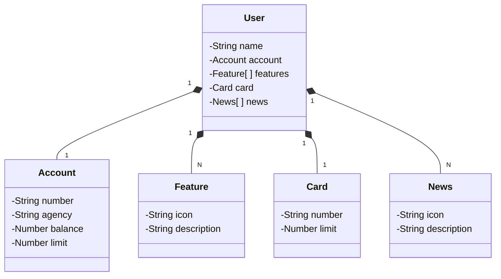

# Santander Dev Week 2023

Java RESTful API criada para projeto final do Bootcamp DIO JAVA SANTANDER

## Principais tecnologias utilizadas

- [Intellij IDEA](https://www.jetbrains.com/pt-br/idea/)
- [PostgresSQL](https://www.postgresql.org/)
- [H2](https://www.h2database.com/)
- [Java 17](https://www.java.com/pt-BR/)
- [Spring Boot 3](https://spring.io/)
- [OpenAPI](https://www.openapis.org/)
- [RailWay](https://railway.app/)

## Descrição do Projeto:

Este projeto visa criar uma API RESTFul de gerenciamento de usuários, conforme o modelo fornecido. A API permitirá a criação, leitura, atualização e exclusão de usuários e seus dados associados. Além disso, a documentação da API será realizada usando o OpenAPI Swagger, tornando-a facilmente acessível e utilizável.

## Funcionalidades:

A API oferece as seguintes funcionalidades:

✔️ Listar Usuários:

- Endpoint: GET /users
- Descrição: Retorna a lista de todos os usuários.

✔️ Obter Usuário por ID:

- Endpoint: GET /users/{id}
- Descrição: Retorna os detalhes de um usuário específico com base em seu ID.

✔️ Criar Usuário:

- Endpoint: POST /users
- Descrição: Cria um novo registro de usuário com base nos dados fornecidos.

✔️ Atualizar Usuário:

- Endpoint: PUT /users/{id}
- Descrição: Atualiza os dados de um usuário existente com base em seu ID.

✔️ Excluir Usuário:

- Endpoint: DELETE /users/{id}
- Descrição: Exclui um usuário com base em seu ID.

## SQL / Banco de Dados

Para este projeto, foram utilizados dois perfis de execução da aplicação. Sendo no perfil de Desenvolvimento utilizado um Banco de Dados [H2](https://www.h2database.com/) em memória e no perfil de Produção utilizado um banco de dados Postgres na nuvem a partir do [RailWay](https://railway.app/).

## Diagrama de classes (Domínio da API)

## [Link do Figma](https://www.figma.com/file/0ZsjwjsYlYd3timxqMWlbj/SANTANDER---Projeto-Web%2FMobile?type=design&node-id=1421-432&mode=design)

O Figma foi utilizado para a abstração do domínio desta API, sendo útil na análise e projeto da solução.

## Como rodar a aplicação

O link da API em produção está disponível abaixo:

[https://sdw-2023-prd.up.railway.app/swagger-ui.html](https://santander-dev-week-2023-production-dd7f.up.railway.app/swagger-ui/index.html)

Esta API ficará disponível no Railway por um período de tempo limitado, mas este é um código-fonte aberto. 
Portanto, sintam-se à vontade para cloná-lo, modificá-lo (já que é um bom projeto base para novos projetos) e executar localmente ou onde achar mais interessante!

Caso tenha interesse, você também pode estar acessando o projeto original divulgado no GitHub da DIO pelo Professor [Falvo Jr](https://github.com/falvojr) clicando [Aqui](https://github.com/digitalinnovationone/santander-dev-week-2023-api).

## Desenvolvedor

[ Alvaro Pires Santos](https://github.com/alvaropires)

